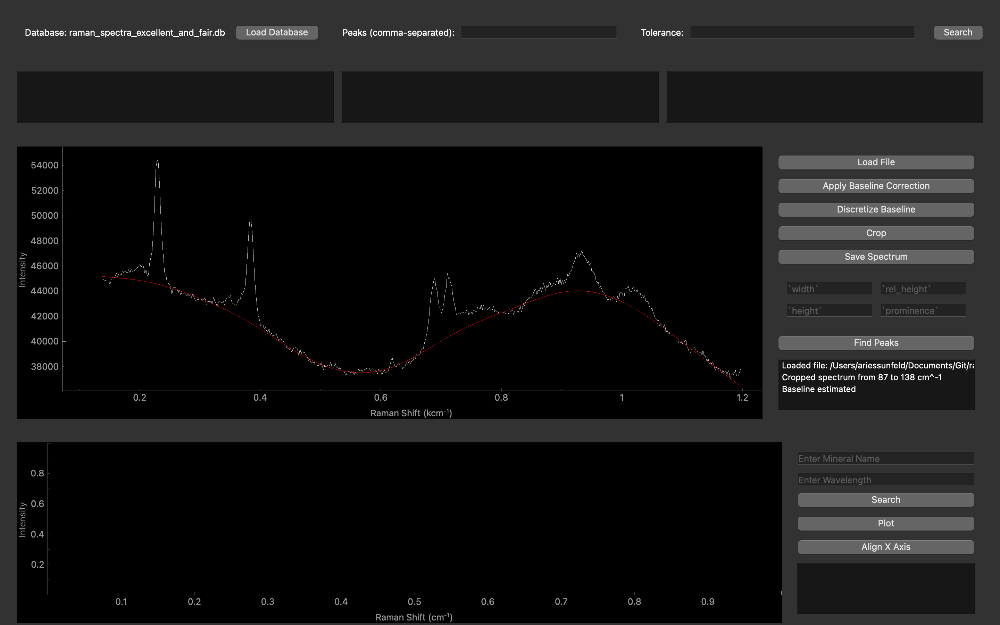
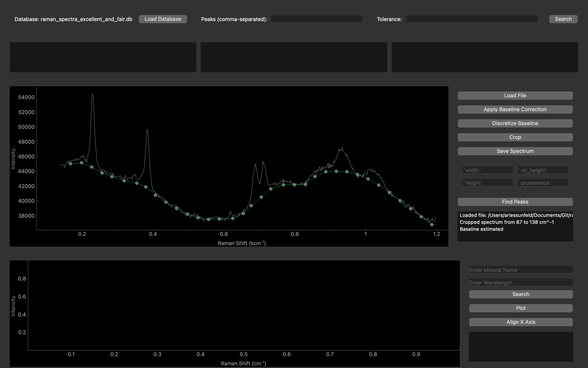

# raman-dp-id

Raman Spectroscopy Data Processing and Mineral Identification Tool, v1.1.0

# Overview

Raman DP-ID is a data-processing and mineral identification tool that serves two purposes:
- Streamline the Raman data **post-processing pipeline**
- Enable **automatic mineral identification** directly from Raman spectra

## Features

Raman DP-ID supports multiple data-processing features, including:
- spectrum cropping
- artifact removal
- automatic **baseline correction**
- manual baseline correction
- automatic **peak identification**

Raman DP-ID also implements several search algorithms to help identify the mineral(s) present in your sample using the peaks idenitifed in your spectra. Reference spectra come from [RRUFF](https://rruff.info/zipped_data_files/raman/) and have been labeled with peak positions. 

<table>
  <tr>
    <td>
        
         
        Automatic spectrum baseline estimate (screenshot of Raman DP-ID usage)
    </td>
    <td>
        
         
        Baseline estimate after discretization, where points are now draggable.
    </td>
  </tr>
</table>

# Setup (macOS)

- **Note: This program requires `python3.11+`**

## Automatic
- Download the [latest release](https://github.com/ariessunfeld/raman-spectroscopy/releases/download/raman-dp-id/raman-dp-id.zip) from GitHub
- Open Finder and unzip the latest release (by double-clicking the `.zip` file)
- **Right-click** `mac_launcher.command`, click Open, then click Open again.
  - Note: If this does not open a new Terminal window automatically, open the Terminal, navigate to the folder containing `mac_launcher.command`, execute `ls` to make sure you see that file, then run `chmod +x mac_launcher.command` to give this file executable privileges. Then repeat this step.

## Manual
- Download the [latest release](https://github.com/ariessunfeld/raman-spectroscopy/releases/download/raman-dp-id/raman-dp-id.zip) from GitHub
- Open Finder and unzip the latest release (by double-clicking the `.zip` file)
- Open a new Terminal window at the folder
- Create a new virtual environment called `venv` by running `python3.11 -m venv venv`
- Activate the new virtual environment by running `source venv/bin/activate`
- Install the necessary packages into the virtual environment by running `pip install -r requirements.txt`
- Navigate into the latest version folder (e.g., `v1.2.3`) by running `cd v1.2.3` (replace with actual version number)
- Launch the program by running `python gui.py`

# Setup (Windows)

- **Note: This program requires `python3.11+`**

## Automatic
- Download the [latest release](https://github.com/ariessunfeld/raman-spectroscopy/releases/download/raman-dp-id/raman-dp-id.zip) from GitHub
- Open File Browser and unzip the latest release (by clicking `Extract All`)
- Browse into the newly unzipped folder and double-click the `windows_launcher.bat` file.
  - If it doesn't open right away, click `More Info` and then `Open Anyway`.

## Manual
- Download the [latest release](https://github.com/ariessunfeld/raman-spectroscopy/releases/download/raman-dp-id/raman-dp-id.zip) from GitHub
- Open File Browser and unzip the latest release (by clicking `Extract All`)
- Open the Command Prompt and navigate into the newly extracted folder
- Create a new virtual environment called `venv` by running `python3.11 -m venv venv`
- Activate the new virtual environment by running `call venv\Scripts\activate.bat`
- Install the necessary packages into the virtual environment by running `pip install -r requirements.txt`
- Navigate into the latest version folder (e.g., `v1.2.3`) by running `cd v1.2.3` (replace with actual version number)
- Launch the program by running `python gui.py`

# Usage

After setup, you can launch the Raman DP-ID tool easily by double-clicking the launch file for your operating system. On macOS, double-click `mac_launcher.command`. On Windows, double-click `windows_launcher.bat`. 

## Data Processing

To use Raman DP-ID as a data processing tool, no database is required.
- Click `Load File` and select your Raman spectrum (supported filetypes: `.csv`, `.txt`, more coming soon) **(see `assets/demo/example_spectrum.txt` for an example file)**
- Click `Crop` to enter Crop Mode; click and drag to select a region of the spectrum to delete
- Click `Apply Crop` to delete the selected region
- Click `Estimate Baseline` to generate an automatic baseline correction estimate
- Click `Apply Baseline Correction` to subtract the estimate from the spectrum OR click `Discretize Baseline`.
- If you discretized the baseline, click and drag the baseline points to edit the line. Then click `Apply Baseline Correction` to subtract the current baseline from the spectrum.
- Click `Save` to save the edited spectrum to disk. Defaults to `[filename]_processed.txt`.

## Mineral Identification

To use Raman DP-ID as a mineral identification tool, a SQLite database of Raman spectra with labeled peak positions is required. Contact ariessunfeld@gmail.com for a download link (automatic download coming soon). Once you have a database,

- Load the database (top left button)
- Load your file for analysis
- Apply any processing / editing as necessary (see steps above)
- Enter peak detection parameters
  - Good default values: `width=5, rel_height=0.5, height=1000`
- Click `Find Peaks`
  - Peaks box (top middle) will auto-fill with detected peak positions
- Enter a Search Tolerance (top right text entry)
  - Good default value: `2`
- Click `Search` (top right)
- To plot a matching mineral, copy the name into the text entry in the bottom right and click `Search` (bottom right)
- Select one or more matching spectra from among those that appear and click `Plot`
- Click `Align X axis` to visually match the peaks with those of your spectrum

## Tips

Raman DP-ID supports many **keyboard shortcuts**, including
- **macOS / (Windows) : Description**
- `Cmd+L` / (`Ctrl+L`) : Load a spectrum file
- `Cmd+S` / (`Ctrl+S`) : Save edited spectrum
- `Cmd+E` / (`Ctrl+E`) : Estimate Baseline & Apply Baseline Correction
- `Cmd+D` / (`Ctrl+D`) : Discretize Baseline
- `Cmd+R` / (`Ctrl+R`) : Enter Crop Mode & Apply Crop
- `Cmd+Z` / (`Ctrl+Z`) : Undo last action
- `Cmd+Shift+Z` / (`Ctrl+Shift+Z`) : Redo last undo

# Questions / Comments / Suggestions?

Please reach out to ariessunfeld@gmail.com!

# Acknowledgements
- **Development**: Ari Essunfeld
- **Domain Expertise**: Jade Comellas
- **Consultation**: Meryem Berrada, Tayro Acosta-Maeda
- **Beta Testing**: Ongoing (thank you to all who provide feedback!)

